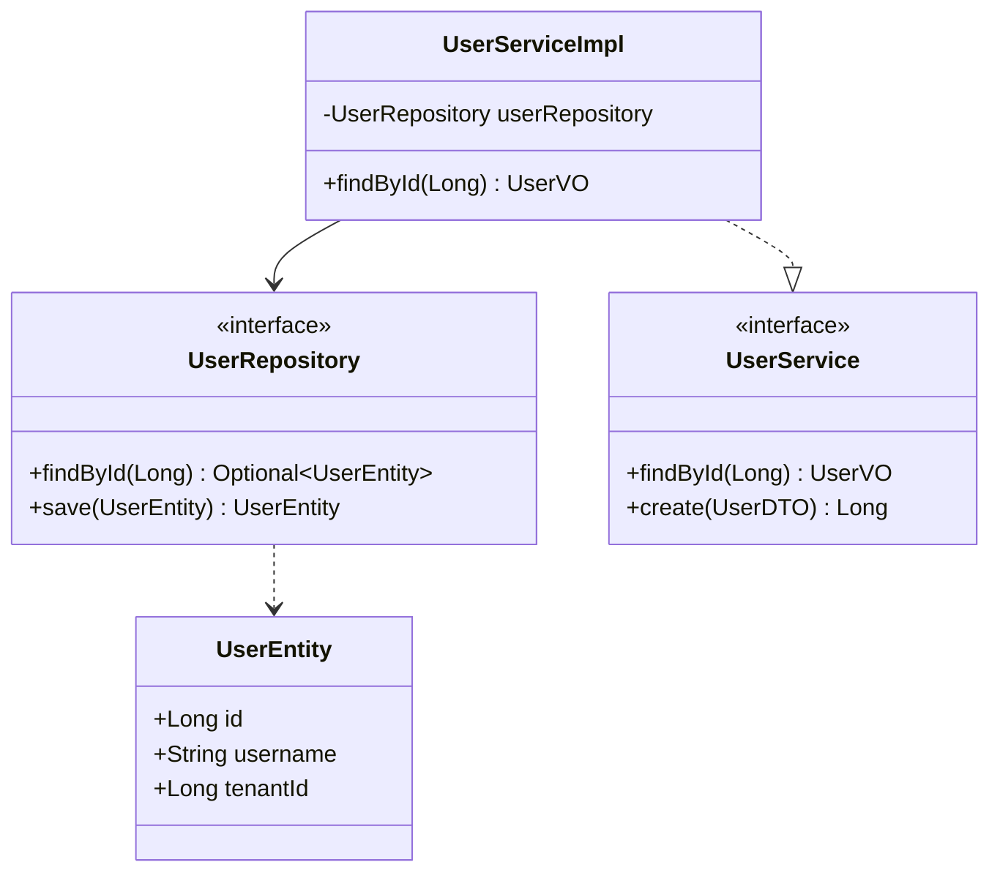
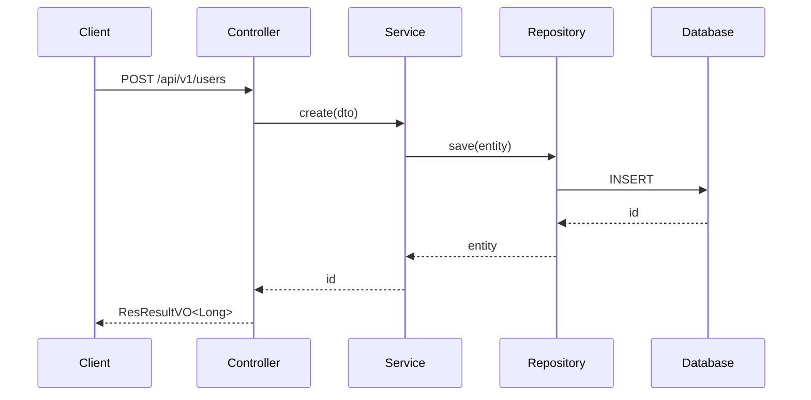

# API 与详细设计

> API 契约 → 详细设计（LLD）→ OpenAPI 文档。产出 `changes/proposals/<id>/design.md`。

前置：变更提案存在；已识别项目栈；新项目 HLD 已完成。

## 第 0 步：确定设计粒度

| 变更规模 | 产出 | 本文档章节 |
|---|---|---|
| 仅新增 / 调整接口 | API 契约 + OpenAPI 注解 | 一 + 三 |
| 功能级变更（含模型 / 流程） | 完整 `design.md` | 一 + 二 + 三 |
| trivial / minor（typo / 配置） | 跳过设计，直接 `coding` | — |

---

# 一、API 契约设计

## 第 1 步：确定 API 类型

| 类型 | 前缀 | 说明 |
|---|---|---|
| **内部 API** | `/api/{资源}` | 前端 / 内部服务调用，需认证 |
| **开放 API** | `/api/open/{资源}` | 第三方调用，需签名 / 开放认证 |

## 第 2 步：设计路径（MUST 遵守）

- ✅ **MUST** `kebab-case`：`/api/user-roles`（不是 `/api/userRoles`）
- ✅ **MUST** 名词复数：`/users`（不是 `/user`）
- ✅ **MUST** 含版本号：`/api/v1/users`
- ❌ **MUST NOT** 含动词：不写 `/api/getUsers`

## 第 3 步：设计 HTTP 方法

| 操作 | 方法 | 路径示例 | 幂等 |
|---|---|---|---|
| 查询单条 | GET | `/api/v1/users/{id}` | ✅ |
| 查询列表 | GET | `/api/v1/users` | ✅ |
| 分页查询 | GET | `/api/v1/users/page` | ✅ |
| 创建 | POST | `/api/v1/users` | ❌（需幂等键） |
| 全量更新 | PUT | `/api/v1/users/{id}` | ✅ |
| 部分更新 | PATCH | `/api/v1/users/{id}` | ❌ |
| 删除 | DELETE | `/api/v1/users/{id}` | ✅ |

## 第 4 步：设计请求 / 响应

请求：路径参数 `@PathVariable`、查询参数 `@RequestParam`、请求体 `@RequestBody @Valid`、分页 `page(UserQuery query, ReqPage reqPage)`。

```java
ResResultVO<UserVO>                  // 统一响应包装
ResResultVO<ResPage<UserVO>>         // 分页响应

ResultUtilSimpleImpl.success(data)
ResultUtilSimpleImpl.fail(code, message)
```

## 第 5 步：设计错误码

```java
public enum UserExceptionEnum {
    USER_NOT_FOUND("USER_001", "用户不存在"),
    USERNAME_DUPLICATED("USER_002", "用户名已存在"),
}
```

- 格式 `{MODULE}_{3 位数字}`
- ✅ **MUST** 在 `{X}ExceptionEnum` 集中管理
- ✅ **MUST** 抛 `CommonException`

## 第 6 步：幂等性设计

非幂等操作（POST / PATCH）MUST 支持幂等：客户端传 `Idempotency-Key` header，服务端用 Redis SETNX 去重。

---

# 二、详细设计（LLD）

## 第 1 步：读 HLD 与提案

```bash
cat changes/proposals/<current>/hld.md       # 新项目
cat changes/proposals/<current>/proposal.md
```

## 第 2 步：类图



## 第 3 步：接口清单

按第一部分的契约列出：

```
GET    /api/v1/users/{id}        → UserVO
GET    /api/v1/users/page        → ResPage<UserVO>
POST   /api/v1/users             → Long
PUT    /api/v1/users/{id}        → void
DELETE /api/v1/users/{id}        → void

GET    /api/open/v1/users/{id}   → UserVO
```

## 第 4 步：数据模型

调用 `data-design` 输出 Entity / PO / DTO / VO / Query 定义、DDL、Flyway 迁移脚本。

## 第 5 步：时序图



## 第 6 步：错误处理表

| 场景 | 错误码 | HTTP 状态 | 处理 |
|---|---|---|---|
| 用户不存在 | USER_001 | 404 | CommonException |
| 用户名重复 | USER_002 | 400 | CommonException |
| 参数校验失败 | COMMON_001 | 400 | CommonException |

## 第 7 步：测试策略

标注各层覆盖范围，交由 `testing` 技能执行：单测（Service 全方法）/ 集成（Controller + Testcontainers）/ E2E（关键业务流程）。

## 第 8 步：产出 design.md

```markdown
# 详细设计：<标题>

## 类图
## 接口定义
## 数据模型
## 时序图
## 错误处理
## 测试策略
## 关键决策
```

---

# 三、OpenAPI 文档

```java
@Tag(name = "用户管理", description = "用户相关 API")
@RestController
@RequestMapping("/api/v1/users")
public class UserController {

    @Operation(summary = "根据 ID 查询用户", description = "返回用户详情")
    @GetMapping("/{id}")
    public ResResultVO<UserVO> findById(
            @Parameter(description = "用户 ID", required = true)
            @PathVariable Long id) {
        return ResultUtilSimpleImpl.success(userService.findById(id));
    }
}
```

访问：`http://localhost:8080/swagger-ui/index.html`

## 关键约束

- ✅ **MUST** 用 `springdoc-openapi`（Spring Boot 4）
- ✅ **MUST** 每个 Controller 有 `@Tag`、每个方法有 `@Operation`、每个参数有 `@Parameter`
- ❌ **MUST NOT** 用 swagger 2.x 老注解（`@Api` / `@ApiOperation`）

---

## 完成标准

- 路径符合 RESTful，响应统一 `ResResultVO<T>`
- 错误码集中管理，无冲突
- 非幂等操作支持幂等键
- 功能级变更有完整 `design.md`（类图 / 接口 / 模型 / 时序 / 错误 / 测试策略）
- OpenAPI 注解完整，Swagger UI 可访问

## 下一步

进入 `coding` 开始编码实现。

## 关联

- 前置：`high-level-design`（新项目）或 `requirement-analysis`（历史项目）
- 后续：`coding`
- 支撑：`data-design`
- 相关：`testing`（执行本技能定义的测试策略）
- Wiki：`wiki/_common/api-design.md`、`wiki/_common/detailed-design.md`、`wiki/<stack>/swagger.md`
