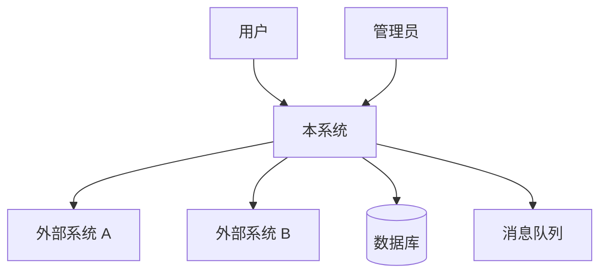
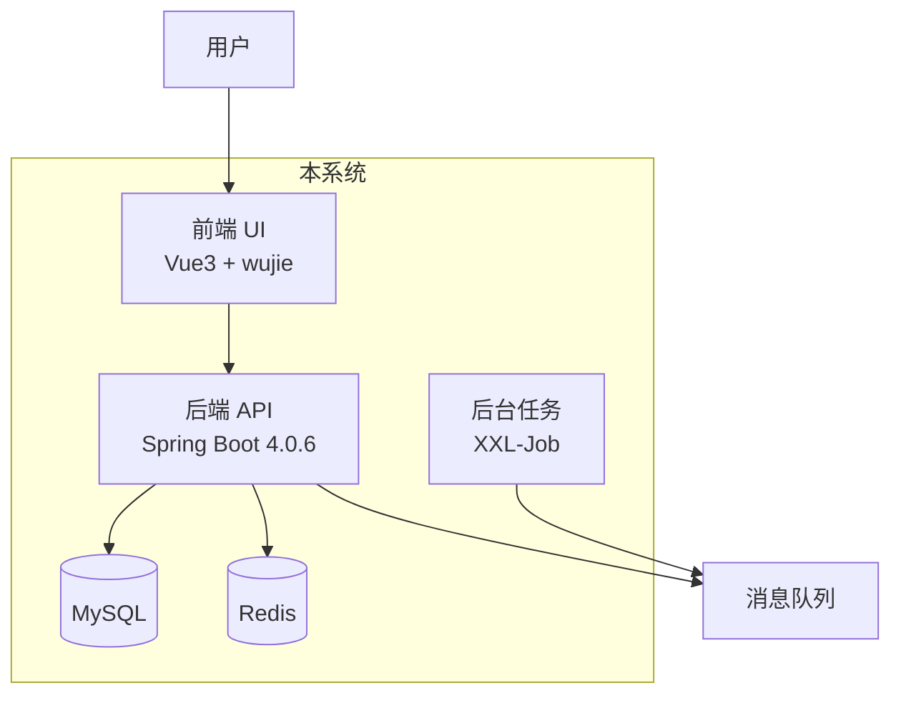

# 概要设计（HLD）与模块拆分

> 用于**新项目**或大版本重构的系统级架构设计。
> 产出 C4 Level 1（系统上下文）+ Level 2（容器）+ 技术选型 + Bounded Context 与模块拆分。

## 前置条件

- 变更提案存在（`changes/proposals/<current>/proposal.md`）
- **新项目**：proposal 类型为"新建项目"
- **大版本重构**：proposal 类型为"架构演进"
- 拆分场景另需明确项目形态（DDD 7+1 / 单体 4 模块）

## 双流程区分

### 新项目流程（MUST 完整执行）

```
需求 → 概要设计（本技能）→ 详细设计（api-design）→ 编码 → ...
```

**MUST 完成 HLD 才能进入 LLD**。

### 历史项目流程（可跳过）

功能更新类变更**通常不需要 HLD**，可直接进入详细设计或编码。
仅当变更涉及**架构调整 / 技术栈升级 / 服务拆分**时才需要 HLD。

---

# 一、系统级设计（HLD）

## 第 1 步：明确系统边界

**MUST 与用户确认**：
- 系统做什么（核心业务价值）
- 系统不做什么（明确非目标）
- 系统的用户是谁（内部 / 外部 / 第三方）
- 系统的上下游（依赖谁 / 被谁依赖）

## 第 2 步：系统上下文图（C4 Level 1）



## 第 3 步：容器图（C4 Level 2）

把系统拆分为"容器"（可独立部署的单元）：



## 第 4 步：技术选型

**MUST 按 stack-constraints 选择**：

| 维度 | 选型 | 理由 |
|---|---|---|
| 后端框架 | Spring Boot 4.0.6 + JDK 17 | stack-constraints 强制 |
| 持久化 | MyBatis-Plus 3.5.16 | 生态标准 |
| 安全 | structure-security | 生态必选 |
| JSON | FastJSON | 生态必选 |
| 服务间调用 | Spring Cloud OpenFeign | 生态标准 |
| 注册中心 | Nacos | 生态标准 |
| 消息队列 | RocketMQ / Kafka | 按需求 |
| 缓存 | Redis | 生态标准 |
| 数据库 | MySQL 8.0 | 生态标准 |
| 前端 | Vue 3 + wujie | 生态标准 |

- ❌ **MUST NOT** 凭 LLM 印象选型（MUST 按 stack-constraints）
- ❌ **MUST NOT** 选生态外的组件（除非有充分理由 + 用户确认）

## 第 5 步：数据流图

```
用户登录：
  用户 → 前端 → API → structure-security（JWT 签发）
                  ↓
                Redis（缓存 token）
                  ↓
                数据库（验证用户）
```

## 第 6 步：风险与缓解

| 风险 | 影响 | 缓解 |
|---|---|---|
| <风险 1> | 高/中/低 | <缓解措施> |

## 第 7 步：产出 HLD 文档

写入 `changes/proposals/<id>/hld.md`：

```markdown
# 概要设计：<标题>

## 系统边界
<做什么 / 不做什么 / 上下游>

## 系统上下文图
<mermaid>

## 容器图
<mermaid>

## 技术选型
<表格>

## 数据流
<关键场景的数据流>

## 风险与缓解
<表格>

## 模块划分（高层）
<各模块职责一句话>
```

---

# 二、模块拆分（DDD / 微服务）

> **MUST 先识别 bounded context，MUST NOT 凭直觉拆分**。

## 第 1 步：识别 Bounded Context（MUST）

```
业务领域
   ├─ 用户上下文（User Context）：用户 / 组织 / 角色 / 权限
   ├─ 订单上下文（Order Context）：订单 / 订单项 / 支付
   ├─ 商品上下文（Product Context）：商品 / 类目 / 库存
   └─ ...
```

**关键问题**（MUST 与用户确认）：
- 业务边界在哪里？
- 哪些概念属于同一上下文？
- 上下文之间如何通信（同步 / 异步 / 共享数据库）？

## 第 2 步：确定拆分粒度

| 粒度 | 说明 | 适用 |
|---|---|---|
| **粗粒度** | 1 个上下文 = 1 个服务 | 小型项目 |
| **中粒度** ⭐ | 1 个上下文 = 1 个服务，内部 7+1 模块 | 中型项目（推荐） |
| **细粒度** | 1 个上下文拆为多个服务 | 大型项目 |

## 第 3 步：生成模块结构

### DDD 7+1 多模块（推荐用于新业务中心）

```
structure-{X}/
├── structure-{X}-dependencies/        # 父 POM
├── structure-{X}-common/              # DTO / VO / Query / enums / exception
├── structure-{X}-domain/              # Entity / Repository 接口 / DomainService
├── structure-{X}-infra/               # RepositoryImpl / RepositoryDelegate
├── structure-{X}-repository-mybatis/  # PO / Mapper / MybatisPlusDelegate / Flyway
├── structure-{X}-application/         # I{X}Service / {X}ServiceImpl / {X}Assembler
├── structure-{X}-interfaces/          # Controller（api/ + open/）
└── structure-{X}-boot/                # 启动类 + application.yaml
```

**模块依赖方向**（MUST 遵守）：

```
common → domain → infra → repository-mybatis
                     ↑
application → domain + infra
interfaces → application
boot → all
```

### 单体 4 模块（老项目 / 小型项目）

```
structure-{X}/
├── {X}-api/           # 接口定义（DTO / VO / Feign 客户端）
├── {X}-biz/           # 业务实现（Service / Manager）
├── {X}-common/        # 通用类（Utils / Constants）
└── {X}-dependencies/  # 父 POM
```

## 第 4 步：生成模块依赖图

| 模块 | 依赖 | 被依赖 | 职责 |
|---|---|---|---|
| common | 无 | domain, infra, application, interfaces | DTO/VO/枚举/异常 |
| domain | common | infra, application | 领域模型 + 领域服务 |
| infra | domain, common | application | 仓储实现防腐层 |
| repository-mybatis | domain, common | infra | MyBatis 持久化 |
| application | domain, infra | interfaces | 应用服务 |
| interfaces | application | boot | 控制器 |
| boot | all | — | 启动 |

## 第 5 步：定义模块间依赖规则

- ✅ **MUST** 允许 `application → domain`、`interfaces → application`
- ❌ **MUST NOT** `domain → infra` / `domain → application` / `interfaces → domain`
- ❌ **MUST NOT** 跨服务直接访问对方数据库（MUST 通过 API / Feign）

## 第 6 步：写入 design.md

把模块拆分结果写入 `changes/proposals/<current>/design.md`：

```markdown
## 模块拆分

### Bounded Context
<识别结果>

### 模块结构
<目录树>

### 模块依赖
<依赖图>

### 关键决策
<决策 1 / 决策 2 / ...>
```

---

## 完成标准

- 系统边界与 bounded context 经用户确认
- 技术选型符合 stack-constraints
- 关键风险已识别
- HLD 文档完整；拆分场景 design.md 含模块拆分章节
- 模块结构符合 DDD 7+1 或单体 4 模块规范，依赖方向无循环

## 下一步

- **新项目**：进入 `api-design`（详细设计）
- **需要落地目录结构**：进入 `project-intake`（脚手架初始化）
- **直接开发**：进入 `coding`

## 关联

- 前置：`requirement-analysis`
- 后续：`api-design` / `project-intake` / `coding`
- Wiki：`wiki/_common/architecture.md`、`wiki/_common/high-level-design.md`、`wiki/_common/project-structure.md`
